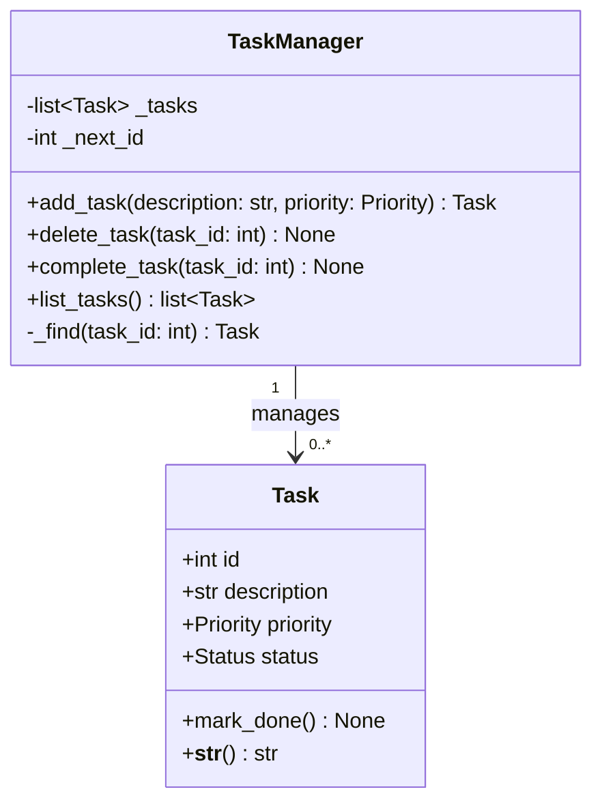

# Class Diagram — SE 420 To-Do List (Refactored)

Generated for Section 3 (Reverse Engineering) of the project report.

## Type aliases

| Alias      | Definition                          |
|------------|-------------------------------------|
| `Priority` | `Literal["Low", "Medium", "High"]`  |
| `Status`   | `Literal["pending", "done"]`        |

## Notes

- `TaskManager._tasks` is private; callers receive a copy via `list_tasks()`.
- `TaskManager._find()` is a private helper used by `delete_task` and
  `complete_task` to keep those methods to two lines each (Refactoring 4).
- `Task` is a plain `@dataclass`; `TaskManager` owns the id-generation
  counter `_next_id` to avoid duplicate ids across its lifetime.
